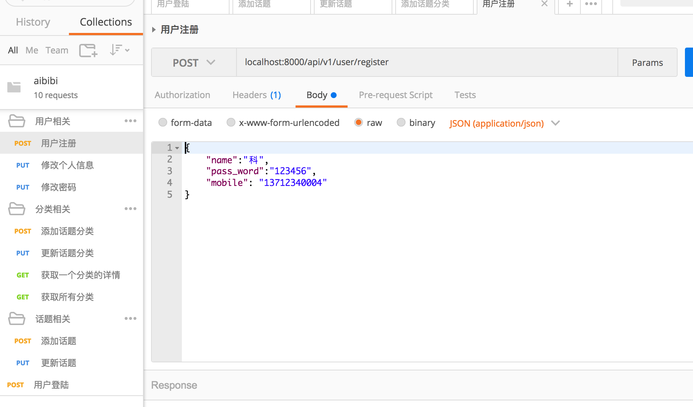

aibibi
======

###项目简介
aibibi基于go语言的gin框架，框架参考goalng123，目前只实现了一些api接口，
可以帮助你用gin实现增、删、改、查。
打算后期使用vue做前端渲染，等基本完成后再上线。

### 基本信息  
- **技术架构**：go语言，后台框架gin，orm使用gorm,数据库mysql,redis 
- **版本**：go:1.9 ，mysql5.7
- **开发工具**：goland
- **开发系统**：macOS
- **项目结构**：  

  - config       项目初始化文件和各种规则文件
  - controller   业务逻辑
  - image        图片存放，后面会改为vue目录文件夹
  - model        数据结构
  - router       路由文件
  - sql          数据库文件（只有部分建表文件，大部分使用的是gorm的自动建表功能）
  - utils        工具类
  - aibibi.postman_collection.json postman请求文件,方便大家调试
  - config.json  相关配置文件
  - main.go      项目启动文件
- **启动项目**：
新建一个zl文件夹,将项目移动至src/github.com下，使项目路径为{gopath}/src/github.com/zl/aibibi  
`go run main.go`
然后就可以通过postman请求了

### 项目持续更新中
觉得有用的话，给个start吧！